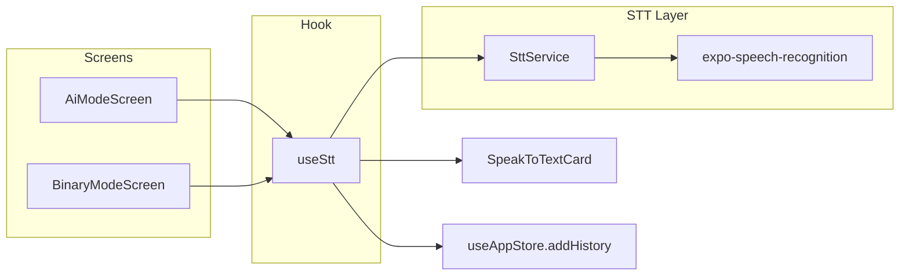

# خطة تنفيذ STT On-device (عربي)

## السياق الحالي

- **Mock فقط:** [`src/features/stt/mockStt.ts`](src/features/stt/mockStt.ts) يرجّع جملة عشوائية بعد `setTimeout` — مستخدم في [`AiModeScreen.tsx`](src/screens/AiModeScreen.tsx) و [`BinaryModeScreen.tsx`](src/screens/BinaryModeScreen.tsx).
- **UI جاهز:** [`SpeakToTextCard.tsx`](src/components/SpeakToTextCard.tsx) يعرض phrase + accuracy + حالة listening — محتاج ربط بخدمة حقيقية فقط.
- **ملف مكرر غير مستخدم:** [`src/features/speech/mockStt.ts`](src/features/speech/mockStt.ts) — يُحذف أو يُدمج أثناء التنفيذ.
- **البنية التحتية:** المشروع أصلاً على **Expo SDK 54 + dev build** (زي ONNX و Bluetooth) — STT هيتبع نفس النمط: **مش هيشتغل في Expo Go**.

## قرارات التصميم (حسب اختيارك)

| البند                 | القرار                                                                                 |
| --------------------- | -------------------------------------------------------------------------------------- |
| اللغة                 | **عربي فقط** — `ar-EG` أولاً، fallback لـ `ar-SA` لو الأول مش متاح on-device           |
| On-device             | `requiresOnDeviceRecognition: true` دائماً                                             |
| لو مفيش language pack | **منع التسجيل** + رسالة توجيه المستخدم لتثبيت حزمة العربي من إعدادات Google            |
| المنصة                | **Android أولاً** (منصة القفاز الأساسية)؛ iOS permissions تُضاف في `app.json` للمستقبل |

## المكتبة المختارة

**[`expo-speech-recognition`](https://www.npmjs.com/package/expo-speech-recognition)** — البديل الموصى به حالياً (بدل `@react-native-voice/voice` المُهمَل).

- Expo config plugin جاهز
- `requiresOnDeviceRecognition` لمنع إرسال الصوت للشبكة
- `getSupportedLocales()` / `supportsOnDeviceRecognition()` للتحقق قبل البدء
- نسخة متوافقة مع SDK 54: `expo-speech-recognition@sdk-54` (أو أحدث stable لـ SDK 54)

## المعمارية المقترحة



## المرحلة 1 — Dependencies و Native config

**الملفات:**

- [`package.json`](package.json)
- [`app.json`](app.json)

**الخطوات:**

1. تثبيت `expo-speech-recognition` (نسخة SDK 54).
2. إضافة plugin في `app.json`:
   ```json
   [
     "expo-speech-recognition",
     {
       "microphonePermission": "SignBridge needs microphone access for speech-to-text.",
       "speechRecognitionPermission": "SignBridge needs speech recognition to convert your voice to text.",
       "androidSpeechServicePackages": [
         "com.google.android.googlequicksearchbox"
       ]
     }
   ]
   ```
3. إضافة صلاحيات Android:
   - `android.permission.RECORD_AUDIO`
4. إضافة iOS (للمستقبل):
   - `NSMicrophoneUsageDescription`
   - `NSSpeechRecognitionUsageDescription`
5. إعادة بناء native:
   ```bash
   npx expo prebuild --platform android --clean
   npm run android
   ```

## المرحلة 2 — طبقة الخدمة `SttService`

**ملفات جديدة في** `src/features/stt/`:

| الملف           | المسؤولية                                                      |
| --------------- | -------------------------------------------------------------- |
| `types.ts`      | `SttResult`, `SttStatus`, `SttErrorCode`                       |
| `SttService.ts` | singleton زي [`TTSService.ts`](src/features/tts/TTSService.ts) |
| `index.ts`      | exports                                                        |

**سلوك `SttService`:**

1. **`checkAvailability()`** عند startup (من `GlovePipelineProvider` أو أول فتح لشاشة فيها مايك):
   - `requestPermissionsAsync()` للمايك
   - `supportsOnDeviceRecognition()`
   - `getSupportedLocales()` → اختيار `ar-EG` أو `ar-SA` من `installedLocales`
   - لو مفيش عربي on-device → `status: 'unavailable'` + `errorMessage` بالعربي/إنجليزي

2. **`startListening()`**:

   ```typescript
   ExpoSpeechRecognitionModule.start({
     lang: selectedLocale, // ar-EG أو ar-SA
     interimResults: true,
     continuous: false, // يوقف عند نتيجة نهائية
     requiresOnDeviceRecognition: true,
     addsPunctuation: true,
   });
   ```

   - الاشتراك في events: `result` (interim + final), `error`, `end`

3. **`stopListening()`** — `ExpoSpeechRecognitionModule.stop()` + `abort()` عند الحاجة

4. **`getResult()`** — يرجع:

   ```typescript
   {
     arabic: string;
     confidence: number;
     isFinal: boolean;
   }
   ```

   - **confidence:** من `event.confidence` لو متاح؛ وإلا تقدير ثابت (مثلاً 90) للـ final results فقط
   - **english:** مش هيتولّد من STT — للـ History نخزن `english: '—'` أو نفس النص العربي مؤقتاً (الترجمة مش ضمن STT on-device)

5. **معالجة الأخطاء:**
   - Permission denied → رسالة واضحة
   - On-device unsupported → "ثبّت حزمة التعرف على الكلام العربي من إعدادات Google"
   - No speech / timeout → رسالة خفيفة بدون crash

## المرحلة 3 — Hook `useStt`

**ملف:** [`src/hooks/useStt.ts`](src/hooks/useStt.ts) (أو داخل `useGlovePipeline.ts` — الأفضل ملف منفصل)

```typescript
export function useStt() {
  // state: isListening, phrase, confidence, error, isAvailable
  // toggleListening() — start/stop
  // onFinalResult → addHistory({ arabic, english: '—', source: 'Speech' })
}
```

- يستبدل منطق `setTimeout` + `recognizeSpeechMock()` في الشاشتين
- يمنع الضغط المزدوج أثناء listening
- يعرض `error` في `SpeakToTextCard` أو تحت الزر

## المرحلة 4 — تحديث UI

### [`SpeakToTextCard.tsx`](src/components/SpeakToTextCard.tsx)

إضافة props اختيارية:

- `error?: string` — رسالة لو المايك/STT غير متاح
- `disabled?: boolean` — لما `!isAvailable`
- تحديث placeholder: `"اضغط المايك واتكلم بالعربي"`

### [`AiModeScreen.tsx`](src/screens/AiModeScreen.tsx) و [`BinaryModeScreen.tsx`](src/screens/BinaryModeScreen.tsx)

- استبدال `recognizeSpeechMock` بـ `useStt()`
- إزالة `useState` المحلي للـ speech (يتحول للـ hook)
- `handleMic` → `toggleListening()`

## المرحلة 5 — تنظيف

- حذف أو إبقاء [`mockStt.ts`](src/features/stt/mockStt.ts) كـ `__DEV__` fallback فقط — **الأفضل حذفه** حسب قرارك (strict on-device)
- حذف [`src/features/speech/mockStt.ts`](src/features/speech/mockStt.ts) (غير مستخدم)

## المرحلة 6 — اختبار على Android

**Checklist:**

```
□ prebuild + run على جهاز حقيقي (مش Expo Go)
□ أول فتح: طلب صلاحية المايك
□ جهاز فيه Arabic on-device → التسجيل يشتغل
□ جهاز بدون language pack → رسالة منع + إرشاد التثبيت
□ AI Mode: مايك → نص عربي → History (source: Speech)
□ Binary Mode: نفس السلوك
□ التسجيل مع القفاز متصل (Bluetooth) — ما يتعارضش مع AI recording
```

**ملاحظة تقنية:** على Android، حزمة `com.google.android.googlequicksearchbox` أو `com.google.android.as` لازم يكون عليها **Arabic speech model**. المستخدم يثبته من: _Settings → Google → Voice → Offline speech recognition_ (المسار قد يختلف حسب الجهاز).

## المخاطر والتخفيف

| المخاطر                               | التخفيف                                                          |
| ------------------------------------- | ---------------------------------------------------------------- |
| عربي on-device مش متاح على كل الأجهزة | فحص `installedLocales` + رسالة واضحة (قرارك)                     |
| دقة العربي أضعف من الإنجليزي          | `contextualStrings` بكلمات المشروع الـ20 من `preprocessors.json` |
| تعارض مايك مع Bluetooth audio         | `iosVoiceProcessingEnabled` + اختبار على الجهاز الحقيقي          |
| تعارض مع زر AI recording              | STT و glove recording منفصلين — مفيش تعارض مباشر                 |

## ترتيب الـ commits المقترح

1. `chore: add expo-speech-recognition and microphone permissions`
2. `feat(stt): add on-device Arabic SttService with locale checks`
3. `feat(ui): wire SpeakToTextCard to real STT in AI and Binary modes`
4. `chore: remove mock STT modules`

## خارج النطاق (لاحقاً)

- ترجمة عربي → إنجليزي للنص المسموع
- اختيار لهجة (مصري vs سعودي) من الإعدادات
- iOS testing كامل
- Cloud STT fallback
