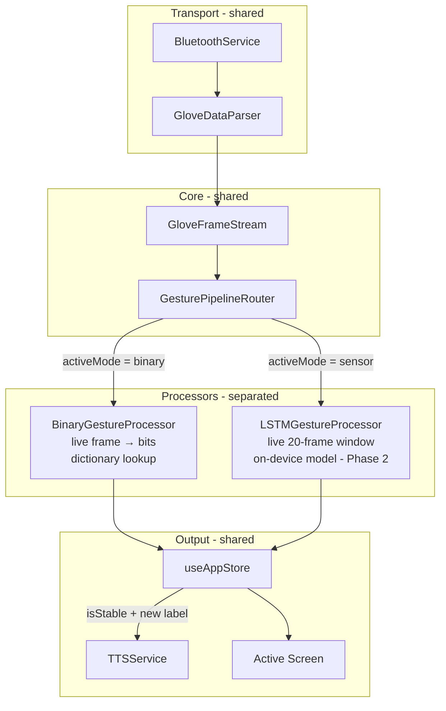
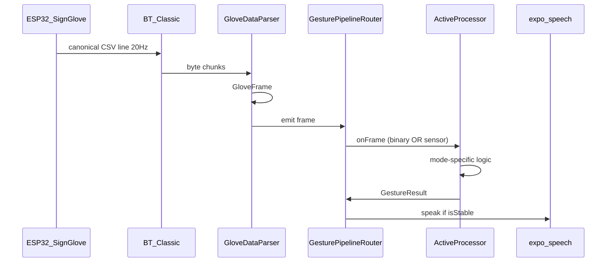
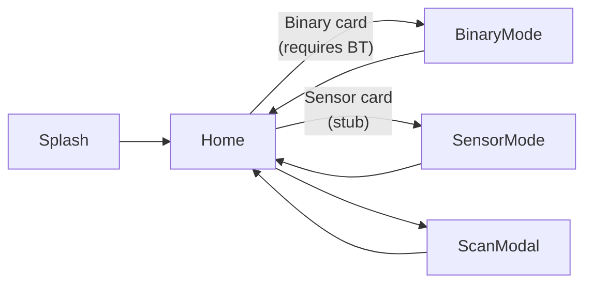

# Phase 1 — Binary Mode MVP

> **Reference:** Full system architecture → [`docs/ARCHITECTURE_REFERENCE.md`](../../docs/ARCHITECTURE_REFERENCE.md)

## Goal

User wears glove → flex sensors stream to app → app converts to 5-bit code → lookup word → display + speak.

**Out of scope for Phase 1:** LSTM inference, BLE migration, dictionary editor UI, flex charts.

---

## Unified Data Protocol (Both Modes)

**Principle:** The glove sends **one canonical format** over Bluetooth **live at 20 Hz**. The app parses **once**, then routes frames to the **active mode processor**. Binary and AI logic stay fully separated.

> **Important:** Dataset CSV files (e.g. `sample_0000.csv`) are **format reference only** for development — the app does **not** load or process pre-recorded datasets. All translation input comes from the **live glove stream**.

### Data Sources (What the App Uses)

| Mode          | Input                    | Translation mechanism                                                  |
| ------------- | ------------------------ | ---------------------------------------------------------------------- |
| **Binary**    | Live `GloveFrame` stream | **Word dictionary** — 5-bit pattern → predefined Arabic word           |
| **Sensor/AI** | Live `GloveFrame` stream | **LSTM model** (in development) — sliding window → on-device inference |

No dataset files, no offline CSV replay in production.

### Wire Format Reference (from sample CSV — shape only)

The sample file illustrates the **line structure** the glove should send live:

```csv
timestamp,flex_thumb,flex_index,flex_middle,flex_ring,flex_pinky,ax,ay,az,gx,gy,gz,pitch,roll
3636547,0,0,0,2915,3382,0.390,0.795,0.288,-4.92,-13.91,-1.37,52.67,-40.86
3636597,0,0,0,2914,3389,0.388,0.796,0.282,-4.48,-13.82,-1.00,52.70,-40.88
```

| Property    | Value                               |
| ----------- | ----------------------------------- |
| Sample rate | **20 Hz** (50 ms between lines)     |
| Flex range  | 0 – ~4095 (ADC raw)                 |
| IMU         | ax, ay, az (g) + gx, gy, gz (deg/s) |
| Orientation | pitch, roll (degrees)               |

### Binarization Rule (Locked)

**Threshold = 2000**

| Flex value | Bit   | Meaning          |
| ---------- | ----- | ---------------- |
| `>= 2000`  | **1** | Bent (مثني)      |
| `< 2000`   | **0** | Straight (مفرود) |

```typescript
// binarize.ts
const THRESHOLD = 2000;
const bit = flexValue >= THRESHOLD ? 1 : 0;
```

Finger order in 5-bit string: **Thumb → Pinky** (e.g. `"10110"`).

### Canonical Live Stream Format (ESP32 → App)

**One CSV line per frame, no header, no `DATA` prefix:**

```
<timestamp>,flex_thumb,flex_index,flex_middle,flex_ring,flex_pinky,ax,ay,az,gx,gy,gz,pitch,roll
```

Example live line:

```
3636547,0,0,0,2915,3382,0.390,0.795,0.288,-4.92,-13.91,-1.37,52.67,-40.86
```

| Field         | Type            | Notes                |
| ------------- | --------------- | -------------------- |
| `timestamp`   | uint32 ms       | `millis()` on ESP32  |
| `flex_*`      | int 0–4095      | Thumb → Pinky        |
| `ax..gz`      | float 3dp / 2dp | Same as dataset      |
| `pitch, roll` | float 2dp       | Complementary filter |

**Firmware change required:** [`test1.ino`](../../../hardware/test1/test1.ino) currently sends `DATA,<ts>,f1..f5,...` — must align to canonical live format above.

**Live stream only:**

| Property       | Live Bluetooth           |
| -------------- | ------------------------ |
| Header row     | No                       |
| `DATA,` prefix | No                       |
| Source         | ESP32 glove in real time |

---

### Unified App Type: `GloveFrame`

```typescript
interface GloveFrame {
  timestamp: number;
  flex: {
    thumb: number;
    index: number;
    middle: number;
    ring: number;
    pinky: number;
  };
  imu: {
    ax: number;
    ay: number;
    az: number;
    gx: number;
    gy: number;
    gz: number;
  };
  orientation: { pitch: number; roll: number };
}

interface GestureResult {
  mode: "binary" | "sensor";
  label: string; // Arabic word
  confidence?: number; // 0–100, sensor mode only
  bits?: string; // e.g. "11100", binary mode only
  phrase?: string; // full sentence for TTS/display
  isStable: boolean; // passed debounce / confidence gate
}
```

---

### Processing Pipeline (Mode-Aware)



**Router rule:** Only the processor matching the **current active mode** receives frames. Switching modes calls `processor.reset()` on the inactive one.

---

### Processor Interface (Separated Logic)

```typescript
interface IGestureProcessor {
  readonly mode: "binary" | "sensor";
  onFrame(frame: GloveFrame): GestureResult | null;
  reset(): void;
}
```

| Processor                | Input                    | Processing                                                 | Output                            |
| ------------------------ | ------------------------ | ---------------------------------------------------------- | --------------------------------- |
| `BinaryGestureProcessor` | Latest live `GloveFrame` | flex → 5 bits (threshold 2000) → debounce → **dictionary** | `{ label, bits, isStable }`       |
| `LSTMGestureProcessor`   | Live buffer of 20 frames | normalize → **LSTM/TFLite model** → smooth                 | `{ label, confidence, isStable }` |

**Shared code:** parser, stream, store, TTS, BT service.  
**Never shared:** binarization, debounce, dictionary, sliding window, ML inference.

---

### Module Layout (Updated)

```
src/features/
├── bluetooth/BluetoothService.ts      # byte stream only
├── parser/
│   ├── GloveDataParser.ts             # CSV line → GloveFrame (both formats during migration)
│   └── types.ts                       # GloveFrame, GestureResult
├── pipeline/
│   ├── GloveFrameStream.ts            # single event bus for parsed frames
│   ├── GesturePipelineRouter.ts       # routes by activeMode
│   └── IGestureProcessor.ts           # interface
├── binary/
│   ├── BinaryGestureProcessor.ts      # implements IGestureProcessor
│   ├── defaultDictionary.ts
│   └── binarize.ts                    # flex → bits (threshold logic)
├── ml/
│   ├── LSTMGestureProcessor.ts        # stub Phase 1, full Phase 2
│   └── SlidingWindowBuffer.ts
├── tts/TTSService.ts
├── hooks/useGlovePipeline.ts          # BT + parser + router + active processor
└── store/useAppStore.ts               # connection, activeMode, lastResult
```

---

## Data Flow



---

## Modules to Build (supersedes earlier list)

```
src/features/bluetooth/BluetoothService.ts
src/features/parser/GloveDataParser.ts + types.ts
src/features/pipeline/GloveFrameStream.ts
src/features/pipeline/GesturePipelineRouter.ts
src/features/binary/BinaryGestureProcessor.ts
src/features/ml/LSTMGestureProcessor.ts      # stub
src/features/tts/TTSService.ts
src/hooks/useGlovePipeline.ts
src/store/useAppStore.ts
```

---

## Deliverables

| #   | Deliverable            | Done when                                   |
| --- | ---------------------- | ------------------------------------------- |
| 1   | Android dev build runs | App installs, no Expo Go                    |
| 2   | Connect to `SignGlove` | Status shows Connected                      |
| 3   | Live 5-bit display     | Bits update from glove in real time         |
| 4   | Dictionary lookup      | Stable pattern maps to word                 |
| 5   | TTS                    | Word spoken on detection                    |
| 6   | Manual fallback        | Toggle bits when glove disconnected         |
| 7   | Firmware aligned       | `test1.ino` sends canonical live CSV format |

---

## Locked Decisions (2026-05-31)

| ID  | Decision           | Choice                                                                           |
| --- | ------------------ | -------------------------------------------------------------------------------- |
| D1  | Bluetooth protocol | **Classic** — matches existing `test1.ino` firmware                              |
| D2  | Binarization       | **Threshold 2000** — `flex >= 2000` → bent (1), `flex < 2000` → straight (0)     |
| D3  | Debounce timing    | **500 ms** — confirmed                                                           |
| D4  | Dictionary content | **Default 32-word Arabic dictionary** — editable later (AsyncStorage, Phase 1.5) |
| D9  | Data source        | **Live glove stream only** — dataset CSV is wire-format reference, not app input |
| D10 | AI translation     | **Live LSTM model** (in development) — not dictionary, not dataset               |
| D5  | TTS                | **On-device Arabic** via `expo-speech` (`lang: 'ar'`)                            |
| D6  | App restructure    | **Full** — Expo Router routes + `src/features/` (as architecture requires)       |
| D7  | Connection UI      | **Home screen** — connect to glove before choosing a mode                        |
| D8  | Platform           | **Android only** for Phase 1 hardware testing                                    |

### D5 note — Arabic on-device TTS

`expo-speech` supports Arabic without a server:

```typescript
Speech.speak("مرحبا", { language: "ar" });
```

Quality depends on the device's installed Arabic TTS engine (Google TTS on most Android phones). No Flask/WiFi needed for Phase 1. Flask from `Smart_Gloves` remains optional fallback if device lacks Arabic voice pack.

### D2 note — Binarization (locked)

```typescript
const FLEX_THRESHOLD = 2000;
// >= 2000 → 1 (bent / مثني)
// <  2000 → 0 (straight / مفرود)
const bits = [thumb, index, middle, ring, pinky].map((v) =>
  v >= FLEX_THRESHOLD ? 1 : 0,
);
```

Finger order: **Thumb → Pinky**.

### D3 note — Debounce (locked)

Pattern must remain stable for **500 ms** before dictionary lookup + auto TTS fire.

### D4 note — Default dictionary (locked)

Ship with `defaultDictionary.ts` — all 32 patterns mapped. User can customize later via AsyncStorage (Phase 1.5 UI). Unmapped patterns fall back to `"غير معرّف"`.

| Bits    | Arabic word | Bits    | Arabic word |
| ------- | ----------- | ------- | ----------- |
| `00000` | جاهز        | `10000` | ماء         |
| `00001` | مرحبا       | `10001` | طعام        |
| `00010` | شكرا        | `10010` | تعبان       |
| `00011` | نعم         | `10011` | بخير        |
| `00100` | لا          | `10100` | سعيد        |
| `00101` | مساعدة      | `10101` | حزين        |
| `00110` | من فضلك     | `10110` | طوارئ       |
| `00111` | آسف         | `10111` | أين         |
| `01000` | صباح الخير  | `11000` | متى         |
| `01001` | مساء الخير  | `11001` | كيف         |
| `01010` | مع السلامة  | `11010` | لماذا       |
| `01011` | تباعد       | `11011` | من          |
| `01100` | أحبك        | `11100` | ماذا        |
| `01101` | أفهم        | `11101` | أريد        |
| `01110` | لا أفهم     | `11110` | انتظر       |
| `01111` | كيف حالك    | `11111` | توقف        |

Stored as:

```typescript
// src/features/binary/defaultDictionary.ts
export const DEFAULT_DICTIONARY: Record<string, string> = {
  "00000": "جاهز",
  "00001": "مرحبا",
  // ... all 32 entries
};
export const UNKNOWN_PATTERN = "غير معرّف";
```

**Phase 1.5:** `BinaryDictionaryStore` loads overrides from AsyncStorage and merges over defaults.

---

## Still Open (discuss next)

_None — Phase 1 decisions locked. Ready for implementation._

## UI Wireframes (Phase 1)

Design language: **dark background** (`#070814`), **cyan neon** (Sensor/BT), **purple neon** (Binary), **green** (connected/live), glass cards with subtle borders.

### Screen Map



---

### 1. Splash (unchanged — 3s auto-navigate)

```
┌─────────────────────────────────┐
│                                 │
│                                 │
│           ✦  (glow)             │
│                                 │
│         SignBridge              │
│   THE AI GESTURE INTERFACES     │
│                                 │
│      ▓▓▓▓▓▓▓▓░░░░  loading      │
│                                 │
│                                 │
└─────────────────────────────────┘
  bg: dark gradient  |  accent: cyan
```

---

### 2. Home Hub (+ Bluetooth panel — NEW in Phase 1)

```
┌─────────────────────────────────┐
│  SYSTEM ONLINE                  │
│  Select Interface               │
│                                 │
│ ┌─────────────────────────────┐ │
│ │ 🔵  GLOVE CONNECTION        │ │
│ │                             │ │
│ │  ● Disconnected             │ │  ← green dot when connected
│ │  Device: —                  │ │
│ │                             │ │
│ │  [  Scan & Connect  ]       │ │  ← opens scan modal
│ │                             │ │
│ │  ⚠ Connect glove to enable  │ │  ← hidden when connected
│ │    Binary Mode              │ │
│ └─────────────────────────────┘ │
│                                 │
│ ┌─────────────────────────────┐ │
│ │ 🖥  Sensor-Based Mode    READY│ │  ← cyan border
│ │  MPU + Flex AI translation  │ │
│ │  Initialize Hardware →      │ │  ← always tappable (stub)
│ └─────────────────────────────┘ │
│                                 │
│ ┌─────────────────────────────┐ │
│ │ ⊞  Binary Custom Mode  LOCKED│ │  ← purple; LOCKED if no BT
│ │  5-bit discrete hand codes  │ │
│ │  Boot Binary Engine →       │ │  ← disabled until connected
│ └─────────────────────────────┘ │
│                                 │
└─────────────────────────────────┘
```

**Connected state changes:**

- Panel shows `● Connected` + `Device: SignGlove`
- Button becomes `[ Disconnect ]`
- Binary card badge: `READY` (green), card enabled

---

### 3. Scan Modal (overlay on Home)

```
┌─────────────────────────────────┐
│ ░░░░░░░░░░░░░░░░░░░░░░░░░░░░░░░ │
│ ░┌───────────────────────────┐░░ │
│ ░│  Available Devices    ✕ │░░ │
│ ░├───────────────────────────┤░░ │
│ ░│  🔄 Scanning...           │░░ │
│ ░│                           │░░ │
│ ░│  ┌─────────────────────┐  │░░ │
│ ░│  │ SignGlove      [Connect]│░░ │
│ ░│  │ AA:BB:CC:DD:EE:FF   │  │░░ │
│ ░│  └─────────────────────┘  │░░ │
│ ░│                           │░░ │
│ ░│  (empty state if none)    │░░ │
│ ░│  "Pair glove in Settings  │░░ │
│ ░│   then tap Scan"          │░░ │
│ ░└───────────────────────────┘░░ │
│ ░░░░░░░░░░░░░░░░░░░░░░░░░░░░░░░ │
└─────────────────────────────────┘
```

---

### 4. Binary Mode (primary Phase 1 screen)

```
┌─────────────────────────────────┐
│ ← Back to Hub    Binary Matrix   │
├─────────────────────────────────┤
│  ● Connected · SignGlove · LIVE   │  ← slim status strip
│                                 │
│  BIT MATRIX CONTROLLER          │
│                                 │
│  ┌────┐ ┌────┐ ┌────┐ ┌────┐ ┌────┐
│  │ F1 │ │ F2 │ │ F3 │ │ F4 │ │ F5 │
│  │ 1  │ │ 0  │ │ 1  │ │ 1  │ │ 0  │  ← live from glove
│  └────┘ └────┘ └────┘ └────┘ └────┘
│   green glow = 1    dim = 0     │
│                                 │
│  Source: [ Glove ● ] [ Manual ] │  ← toggle when disconnected
│                                 │
│ ┌─────────────────────────────┐ │
│ │   CURRENT SIGN MAPPING      │ │
│ │                             │ │
│ │         طوارئ               │ │  ← large Arabic word
│ │         10110               │ │  ← bit pattern (small)
│ │                             │ │
│ └─────────────────────────────┘ │
│                                 │
│ ┌─────────────────────────────┐ │
│ │  SAVED PHRASE          🔊   │ │  ← TTS replay button
│ │  Immediate assistance       │ │
│ │  requested.                 │ │
│ └─────────────────────────────┘ │
│                                 │
│  ┌───────────────────────────┐  │
│  │  ↻  Sync Custom Dictionary│  │  ← Phase 1.5 (disabled/placeholder)
│  └───────────────────────────┘  │
│                                 │
│  Raw: 2100 450 3800 3900 2200   │  ← optional debug row (dev only)
└─────────────────────────────────┘
  accent: purple neon
```

**Manual fallback (glove disconnected):**

- `Source: [ Glove ○ ] [ Manual ● ]`
- Bit nodes become tappable (current behavior)
- Status strip: `○ Disconnected · Manual Mode`

---

### 5. Sensor Mode (Phase 1 stub)

```
┌─────────────────────────────────┐
│ ← Back to Hub    Sensor Glove    │
├─────────────────────────────────┤
│  ● Connected · SignGlove          │
│                                 │
│ ┌─────────────────────────────┐ │
│ │                             │ │
│ │     🤖  AI ENGINE           │ │
│ │                             │ │
│ │   Coming in Phase 2         │ │
│ │                             │ │
│ │   LSTM gesture recognition  │ │
│ │   will run on-device here   │ │
│ │                             │ │
│ └─────────────────────────────┘ │
│                                 │
│ ┌─────────────────────────────┐ │
│ │  Live Flex Preview (read-only)│
│ │  F1 ████████░░  2100        │ │
│ │  F2 ██░░░░░░░░   450        │ │  ← shows raw stream
│ │  F3 █████████░  3800        │ │     (no AI yet)
│ │  F4 █████████░  3900        │ │
│ │  F5 ███████░░░  2200        │ │
│ └─────────────────────────────┘ │
│                                 │
│  [ START ENGINE ]  ← disabled   │
│                                 │
└─────────────────────────────────┘
  accent: cyan neon
```

Shows live flex values from glove (proves BT pipeline works) without AI.

---

### 6. Component Inventory

| Component                  | Used on        | Phase        |
| -------------------------- | -------------- | ------------ |
| `ConnectionPanel`          | Home           | 1            |
| `DeviceScanModal`          | Home           | 1            |
| `ConnectionStatusBar`      | Binary, Sensor | 1            |
| `BitMatrix`                | Binary         | 1            |
| `PredictionDisplay`        | Binary         | 1            |
| `PhraseCard` + `TTSButton` | Binary         | 1            |
| `FlexPreviewBars`          | Sensor stub    | 1            |
| `GlassCard`                | Home           | 1 (existing) |

---

### 7. Interaction Notes

| Action                     | Behavior                               |
| -------------------------- | -------------------------------------- |
| Tap Scan & Connect         | Opens modal, scans for `SignGlove`     |
| Binary card (disconnected) | Disabled + toast "Connect glove first" |
| Binary card (connected)    | Navigate to Binary Mode                |
| Stable gesture 500 ms      | Update word + auto TTS (Arabic)        |
| Tap 🔊                     | Replay last phrase                     |
| Toggle Manual              | Override bits when no glove            |
| Sensor START               | Disabled in Phase 1                    |

---

## Suggested Build Order

1. Lock decisions (D1–D8)
2. `expo prebuild` + install native BT library
3. BluetoothService + parser (test with Serial Monitor log replay first)
4. BinaryGestureEngine + default dictionary
5. TTSService
6. Wire BinaryModeScreen
7. Physical glove test on Android

---

## Success Criteria

- [ ] App connects to ESP32 `SignGlove` on Android
- [ ] Bending fingers updates 5-bit display within 100 ms
- [ ] Holding a gesture for ~500 ms triggers correct word
- [ ] TTS speaks the word once (no spam)
- [ ] Manual mode works when BT disconnected
- [ ] Sensor Mode still visible but shows "Coming in Phase 2"
