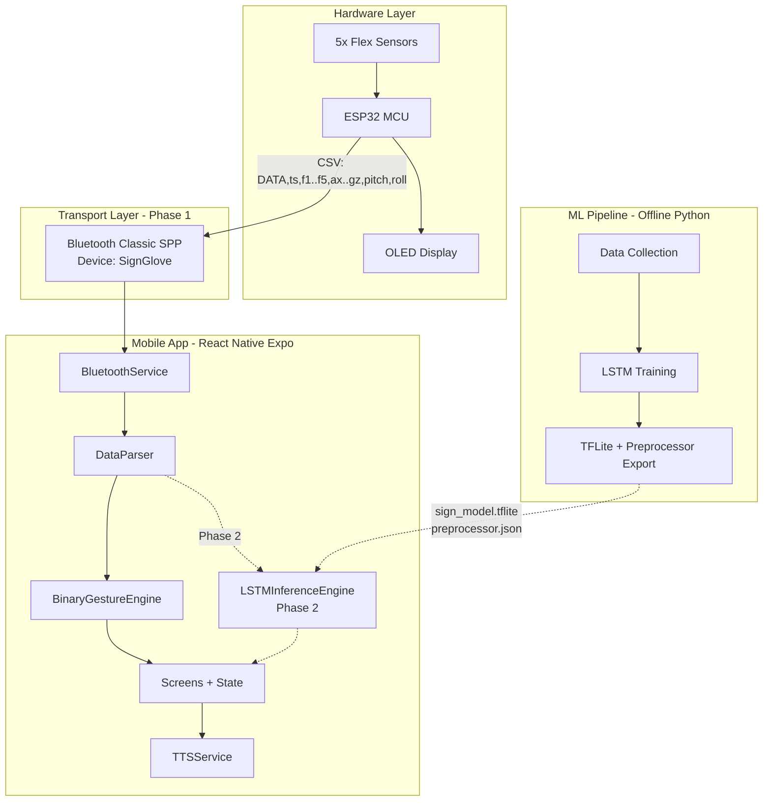
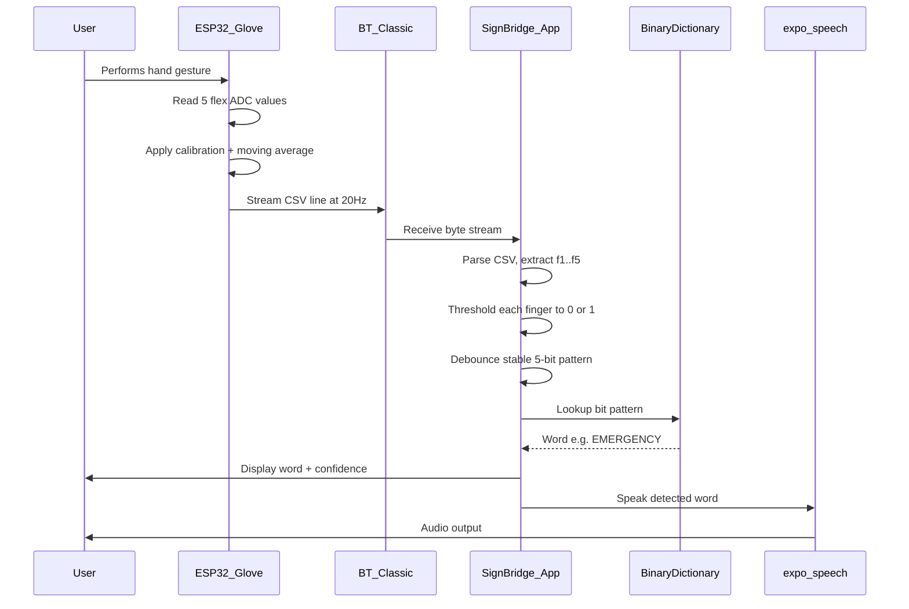
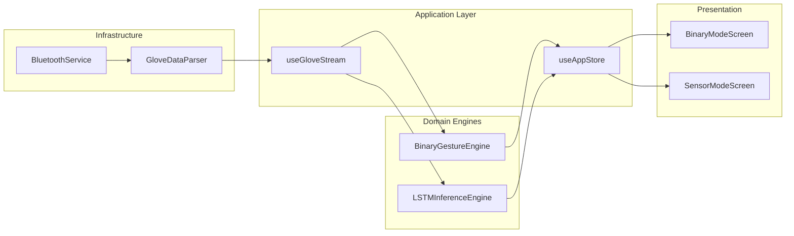
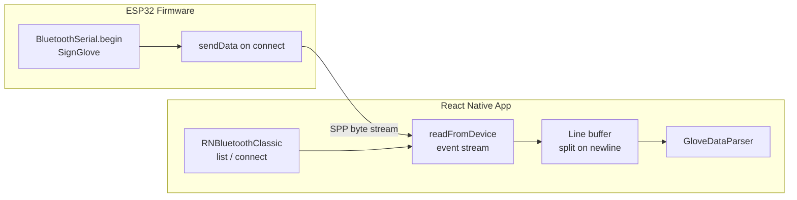
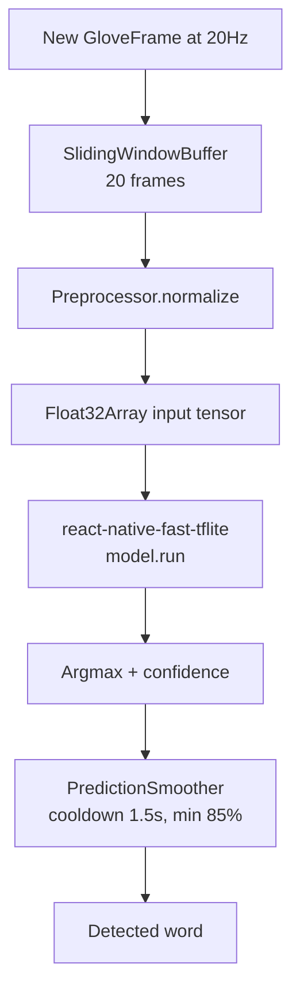

# SignBridge — Full System Architecture Plan

## Executive Summary

You are building a **closed-loop assistive system**: ESP32 glove → wireless stream → React Native app → gesture interpretation → UI + speech. The repo already contains **four isolated tracks** that must be integrated:

| Track | Location | Status |
|-------|----------| UpdateStatus |
| Mobile UI prototype | [`smart-glove-app/`](g:/last_year_in_hell/graduation_project/react_native_app/smart-glove-app) | UI only, no hardware/ML/TTS |
| ESP32 firmware | [`hardware/test1/test1.ino`](g:/last_year_in_hell/graduation_project/hardware/test1/test1.ino) | Working at 20 Hz, **Bluetooth Classic** |
| LSTM training | [`en-sign-language/`](g:/last_year_in_hell/graduation_project/en-sign-language) | `.h5` + `.joblib`, **not mobile-ready** |
| TTS reference | [`Smart_Gloves/mobile_app/`](g:/last_year_in_hell/graduation_project/Smart_Gloves/mobile_app) | Flask API pattern (optional fallback) |

**Agreed direction:** Ship **Binary Mode + Bluetooth Classic** first; architect the app so **Sensor/AI Mode** plugs in when the LSTM pipeline is ready.

---

## 1. System Architecture (High Level)



---

## 2. Complete System Workflow

### Phase 1 — Binary Mode (Current Priority)



**Steps mapped to your spec:**

1. User performs gesture → glove reads flex values
2. ESP32 sends readings via **Bluetooth Classic** (not BLE yet)
3. App maintains latest sensor snapshot (sliding buffer reserved for Phase 2)
4. App binarizes: `flex > threshold → 1, else → 0`
5. Stable pattern (held ~300–500 ms) triggers dictionary lookup
6. Word displayed + spoken via TTS

### Phase 2 — AI Sensor Mode (Future)

1. App buffers last **N frames** (e.g. 20 frames × 5 sensors = 100 values)
2. Preprocess: normalize using exported `StandardScaler` params
3. Reshape to model input tensor `(1, timesteps, features)`
4. Run TFLite inference → softmax class + confidence
5. Apply prediction smoothing (majority vote / confidence threshold)
6. Display + TTS

---

## 3. Required Modules

### Hardware (ESP32) — existing, minor changes only

| Module         | Responsibility                                            |
| -------------- | --------------------------------------------------------- |
| SensorReader   | ADC read on pins 35, 32, 33, 25, 26                       |
| FlexCalibrator | Min/max calibration per finger                            |
| SignalFilter   | 5-sample moving average + optional LPF                    |
| DataFormatter  | CSV: `DATA,timestamp,f1..f5,ax,ay,az,gx,gy,gz,pitch,roll` |
| BTTransmitter  | `BluetoothSerial` stream when client connected            |
| OLEDStatus     | Connection + flex % display                               |

**Firmware output (from [`test1.ino`](g:/last_year_in_hell/graduation_project/hardware/test1/test1.ino)):**

```
DATA,<timestamp_ms>,<f1_raw>,<f2_raw>,...,<f5_raw>,<ax>,<ay>,<az>,<gx>,<gy>,<gz>,<pitch>,<roll>
```

### Mobile App — to be built

| Module                  | Phase | Responsibility                                     |
| ----------------------- | ----- | -------------------------------------------------- |
| `BluetoothService`      | 1     | Scan, pair, connect, subscribe to SPP stream       |
| `GloveDataParser`       | 1     | Parse CSV lines, validate, emit typed `GloveFrame` |
| `BinaryGestureEngine`   | 1     | Threshold, debounce, dictionary lookup             |
| `BinaryDictionaryStore` | 1     | 32-entry map, CRUD, AsyncStorage persistence       |
| `SlidingWindowBuffer`   | 2     | Ring buffer for N frames of sensor data            |
| `Preprocessor`          | 2     | StandardScaler + reshape matching training         |
| `LSTMInferenceEngine`   | 2     | Load TFLite, run inference, decode labels          |
| `PredictionSmoother`    | 2     | Confidence gate, cooldown, duplicate suppression   |
| `TTSService`            | 1     | On-device speech via `expo-speech`                 |
| `AppStateStore`         | 1     | Connection status, mode, last prediction, history  |
| `Screens`               | 1     | Splash, Home, BinaryMode, SensorMode (stub → full) |

### ML Pipeline (Python, offline) — Phase 2

| Module            | Responsibility                                              |
| ----------------- | ----------------------------------------------------------- |
| Data collector    | Record live CSV from glove into labeled sequences           |
| Retraining script | LSTM with `(timesteps, features)` input aligned to firmware |
| Export script     | `.h5` → `.tflite` + JSON scaler/label encoder               |
| Validation        | Compare Python vs mobile inference on same test vectors     |

---

## 4. React Native App Architecture

### Architectural Pattern: **Layered + Feature Modules**

```
Presentation (Screens/Components)
        ↓
Application (Hooks + Stores)
        ↓
Domain (Engines: Binary, LSTM, Dictionary)
        ↓
Infrastructure (Bluetooth, TTS, Storage, ML Runtime)
```

**Key design decisions:**

- **Expo Development Build required** — Bluetooth Classic and TFLite need native modules; Expo Go will not work.
- **Replace in-file navigation** in [`app/index.tsx`](g:/last_year_in_hell/graduation_project/react_native_app/smart-glove-app/app/index.tsx) with proper Expo Router routes.
- **Single `GloveDataStream` abstraction** — both Binary and AI modes consume the same parsed frames; only the engine differs.
- **Mode switch at engine level**, not at Bluetooth level — one connection, two interpreters.



---

## 5. Suggested Folder Structure

```
smart-glove-app/
├── app/                              # Expo Router (routes only)
│   ├── _layout.tsx                   # Root stack + providers
│   ├── index.tsx                     # Splash → redirect
│   ├── home.tsx                      # Mode selection hub
│   ├── binary-mode.tsx
│   └── sensor-mode.tsx
│
├── src/
│   ├── components/                   # Reusable UI
│   │   ├── GlassCard.tsx
│   │   ├── BitMatrix.tsx
│   │   ├── PredictionDisplay.tsx
│   │   ├── ConnectionStatusBar.tsx
│   │   └── TTSButton.tsx
│   │
│   ├── features/
│   │   ├── bluetooth/
│   │   │   ├── BluetoothService.ts   # Singleton service
│   │   │   ├── types.ts              # GloveFrame, ConnectionState
│   │   │   └── constants.ts          # Device name "SignGlove"
│   │   │
│   │   ├── parser/
│   │   │   └── GloveDataParser.ts    # CSV line → GloveFrame
│   │   │
│   │   ├── binary/
│   │   │   ├── BinaryGestureEngine.ts
│   │   │   ├── defaultDictionary.ts  # 32 word mappings
│   │   │   └── useBinaryGesture.ts
│   │   │
│   │   ├── ml/                       # Phase 2 — scaffold now
│   │   │   ├── SlidingWindowBuffer.ts
│   │   │   ├── Preprocessor.ts
│   │   │   ├── LSTMInferenceEngine.ts
│   │   │   ├── PredictionSmoother.ts
│   │   │   └── useLSTMPrediction.ts
│   │   │
│   │   └── tts/
│   │       └── TTSService.ts         # expo-speech wrapper
│   │
│   ├── store/
│   │   └── useAppStore.ts            # Zustand global state
│   │
│   ├── hooks/
│   │   └── useGloveStream.ts         # Shared stream hook
│   │
│   ├── theme/
│   │   └── theme.ts                  # Move from app/theme.ts
│   │
│   └── types/
│       └── index.ts
│
├── assets/
│   ├── models/                       # Phase 2
│   │   ├── sign_lstm.tflite
│   │   └── preprocessors.json
│   └── images/
│
├── app.json                          # Native plugins config
├── eas.json                          # EAS Build profiles
└── package.json
```

---

## 6. Bluetooth Communication Architecture

### Phase 1: Bluetooth Classic (matches existing firmware)



**Recommended library:** [`react-native-bluetooth-classic`](https://github.com/kenjdavidson/react-native-bluetooth-classic)

- Supports Expo via config plugin + `expo prebuild`
- Works with ESP32 `BluetoothSerial` (SPP profile)
- Provides device discovery, pairing, connection, read/write streams

**Alternative:** [`react-native-bluetooth-serial-next`](https://github.com/nuttawutmalee/react-native-bluetooth-serial-next) — simpler but less maintained.

**Service design (`BluetoothService.ts`):**

```typescript
// Conceptual interface — not implementation
type ConnectionState =
  | "disconnected"
  | "scanning"
  | "connecting"
  | "connected"
  | "error";

interface BluetoothService {
  startScan(): Promise<void>;
  connect(deviceId: string): Promise<void>;
  disconnect(): Promise<void>;
  onFrame(callback: (frame: GloveFrame) => void): () => void;
  onConnectionChange(callback: (state: ConnectionState) => void): () => void;
}
```

**Parsing strategy:**

- Maintain a `String buffer` across incoming chunks
- Split on `\n`, parse lines starting with `DATA,`
- Validate 14 numeric fields; discard malformed lines
- Emit `GloveFrame { timestamp, flex: number[5], imu: {...}, pitch, roll }`

**Permissions (Android):** `BLUETOOTH`, `BLUETOOTH_ADMIN`, `BLUETOOTH_CONNECT`, `BLUETOOTH_SCAN`, `ACCESS_FINE_LOCATION` (pre-Android 12)

**Permissions (iOS):** Bluetooth usage description in Info.plist; note iOS has limited Classic BT support — **test on Android first** for graduation demo.

### Phase 2 Upgrade Path: BLE GATT

When firmware migrates to BLE:

- Add `BleBluetoothService` implementing the same `IBluetoothService` interface
- Define GATT service/characteristic UUIDs in firmware datasheet
- Use `react-native-ble-plx` with `monitorCharacteristicForService` for notifications
- App selects transport via factory: `createBluetoothService('classic' | 'ble')`

---

## 7. LSTM Model Integration (Phase 2 Design)

### Current ML Reality vs Target

| Aspect      | Current ([`train_lstm_signs.py`](g:/last_year_in_hell/graduation_project/en-sign-language/train_lstm_signs.py)) | Target for Mobile                             |
| ----------- | --------------------------------------------------------------------------------------------------------------- | --------------------------------------------- |
| Input shape | `(1, 1, ~440)` — single timestep, all features flat                                                             | `(1, 20, 5)` or `(1, 20, 11)` — true sequence |
| Features    | Dual-hand flex + position + orientation × 20 frames                                                             | Single glove: 5 flex (+ optional IMU)         |
| Labels      | 7 signs: PAUSE, PROUD, STUDENT, THANK YOU, THIS, WE, WORK                                                       | Same or expanded                              |
| Export      | `.h5` + `.joblib` only                                                                                          | `.tflite` + JSON preprocessors                |
| Inference   | Python desktop CLI                                                                                              | On-device via TFLite runtime                  |

**Recommendation when LSTM work begins:** Retrain with sequence input matching firmware output, then export.

### Export Pipeline (Python side)

```
sign_lstm_model.h5
    → tf.lite.TFLiteConverter.from_keras_model()
    → sign_lstm.tflite

joblib preprocessors
    → preprocessors.json { scaler_mean, scaler_scale, labels[] }
```

### Mobile Inference Pipeline



### Library Recommendation: TFLite vs ONNX

| Library                             | Pros                                  | Cons                                                   | Verdict                              |
| ----------------------------------- | ------------------------------------- | ------------------------------------------------------ | ------------------------------------ |
| **`react-native-fast-tflite`**      | JSI, fast, GPU delegates (CoreML iOS) | Requires dev build; verify Android on your SDK version | **Primary choice**                   |
| **`@tensorflow/tfjs-react-native`** | Pure JS, easier setup                 | Slow for LSTM; not ideal for real-time 20Hz            | Fallback / prototyping only          |
| **`onnxruntime-react-native`**      | Cross-platform, good Android          | Extra conversion step from Keras; larger bundle        | Alternative if TFLite Android issues |

**Decision:** Use **TensorFlow Lite** — your training is already in TensorFlow/Keras; conversion path is direct.

### Integration scaffold (build now, wire later)

Create empty implementations in `src/features/ml/`:

- `SlidingWindowBuffer` — ring buffer, `addFrame()`, `getSequence()`
- `LSTMInferenceEngine` — `loadModel()`, `predict()`, returns `{ label, confidence }`
- `useLSTMPrediction` — hook that activates only in Sensor Mode when model file exists

Sensor Mode screen shows **"Model not loaded"** until Phase 2; Binary Mode works independently.

---

## 8. Recommended Libraries

### Bluetooth Classic (Phase 1)

- **`react-native-bluetooth-classic`** — ESP32 SPP compatibility, Expo config plugin

### BLE (Phase 2, future firmware)

- **`react-native-ble-plx`** — industry standard, Expo-compatible with prebuild

### On-Device ML (Phase 2)

- **`react-native-fast-tflite`** — TFLite inference with JSI
- Export assets: `assets/models/sign_lstm.tflite`, `assets/models/preprocessors.json`

### Text-to-Speech (Phase 1)

- **`expo-speech`** — already in [`package.json`](g:/last_year_in_hell/graduation_project/react_native_app/smart-glove-app/package.json); offline, no server needed, English support
- Optional fallback: reuse Flask TTS from [`Smart_Gloves/server`](g:/last_year_in_hell/graduation_project/Smart_Gloves/server) for Arabic via network

### State Management

- **`zustand`** — lightweight, minimal boilerplate, ideal for connection state + predictions + mode
- Avoid Redux unless team already uses it

### Storage

- **`@slots/async-storage`** — persist binary dictionary customizations

### Already installed but repurpose/remove

- `axios` — only if Flask TTS fallback needed
- `nativewind` — optional; current app uses StyleSheet (keep consistent)
- `react-native-chart-kit` — useful in Sensor Mode for live flex graph (Phase 1.5 enhancement)

---

## 9. Challenges and Solutions

| Challenge                                        | Impact                                   | Solution                                                                                 |
| ------------------------------------------------ | ---------------------------------------- | ---------------------------------------------------------------------------------------- |
| **Firmware uses Classic BT, spec says BLE**      | Architecture mismatch                    | Phase 1: Classic. Abstract `IBluetoothService` for future BLE swap                       |
| **iOS Bluetooth Classic limitations**            | Demo may fail on iPhone                  | Primary demo on Android; document iOS constraints                                        |
| **Expo Go cannot run native BT/ML**              | Dev blocked in sandbox                   | Use `expo prebuild` + EAS Development Build                                              |
| **ML model not aligned with live stream**        | Wrong predictions                        | Phase 2: retrain on `(timesteps, 5)` from live glove data; defer until Binary Mode works |
| **440-feature model vs 5-sensor stream**         | Cannot use current `.h5` on device as-is | Do not port current model; retrain when ready                                            |
| **Real-time jitter at 20Hz**                     | UI flicker, false triggers               | Debounce binary patterns; confidence + cooldown for LSTM                                 |
| **Flex sensor variation between users**          | Wrong 0/1 binarization                   | Per-user calibration screen; use firmware `flexMin`/`flexMax` or app-side thresholds     |
| **TTS spam on rapid gestures**                   | Annoying UX                              | Speak only on stable new word; 2s cooldown                                               |
| **README merge conflict + missing assets**       | Broken onboarding                        | Fix README; add placeholder assets before first build                                    |
| **No `requirements.txt` in Smart_Gloves server** | Reproducibility                          | Document separately; not blocking Binary Mode                                            |

---

## 10. Professional Software Architecture Diagram

```
╔══════════════════════════════════════════════════════════════════════════════╗
║                    SIGNBRIDGE — SYSTEM ARCHITECTURE v1.0                     ║
╠══════════════════════════════════════════════════════════════════════════════╣
║                                                                              ║
║  ┌─────────────────────────────────────────────────────────────────────┐     ║
║  │                        PHYSICAL LAYER                                │     ║
║  │  [Thumb][Index][Middle][Ring][Pinky] ──► 5× Flex Sensors (ADC)      │     ║
║  │  [MPU6050 IMU] ──► Accel + Gyro ──► Pitch/Roll                       │     ║
║  │  [OLED SSD1306] ──► Local status display                             │     ║
║  └──────────────────────────────┬──────────────────────────────────────┘     ║
║                                 │                                            ║
║  ┌──────────────────────────────▼──────────────────────────────────────┐     ║
║  │                     EMBEDDED LAYER (ESP32)                           │     ║
║  │  ┌─────────────┐  ┌──────────────┐  ┌─────────────┐  ┌────────────┐  │     ║
║  │  │ ADC Reader  │─►│ Calibrator   │─►│ MA Filter   │─►│ CSV Builder│  │     ║
║  │  └─────────────┘  └──────────────┘  └─────────────┘  └─────┬──────┘  │     ║
║  │  ┌─────────────┐  ┌──────────────┐                           │        │     ║
║  │  │ MPU Reader  │─►│ Compl. Filter│───────────────────────────┘        │     ║
║  │  └─────────────┘  └──────────────┘                                    │     ║
║  │                          │                                            │     ║
║  │              ┌───────────▼───────────┐                                │     ║
║  │              │ BluetoothSerial (SPP)  │  Device: "SignGlove"          │     ║
║  │              │ 115200 baud, 20 Hz     │                                │     ║
║  │              └───────────┬───────────┘                                │     ║
║  └──────────────────────────┼────────────────────────────────────────────┘     ║
║                             │ Wireless (Bluetooth Classic)                     ║
║  ┌──────────────────────────▼────────────────────────────────────────────┐     ║
║  │                   MOBILE APP — REACT NATIVE (EXPO)                     │     ║
║  │                                                                        │     ║
║  │  INFRASTRUCTURE                                                        │     ║
║  │  ┌──────────────────┐    ┌─────────────────┐    ┌─────────────────┐   │     ║
║  │  │ BluetoothService │───►│ GloveDataParser │───►│ useGloveStream  │   │     ║
║  │  │ (Classic → BLE*) │    │ CSV → GloveFrame│    │ (shared hook)   │   │     ║
║  │  └──────────────────┘    └─────────────────┘    └────────┬────────┘   │     ║
║  │                                                          │             │     ║
║  │  DOMAIN ENGINES (mode switch)                            │             │     ║
║  │  ┌────────────────────────┐    ┌────────────────────────▼──────────┐  │     ║
║  │  │ BinaryGestureEngine ★  │    │ LSTMInferenceEngine (Phase 2)      │  │     ║
║  │  │ • threshold → 5 bits   │    │ • SlidingWindowBuffer (20 frames)  │  │     ║
║  │  │ • debounce 400ms       │    │ • Preprocessor (StandardScaler)    │  │     ║
║  │  │ • dictionary lookup    │    │ • TFLite inference + smoother      │  │     ║
║  │  │ • 32 word mappings     │    │ • 7+ sign classes                  │  │     ║
║  │  └───────────┬────────────┘    └──────────────────┬─────────────────┘  │     ║
║  │              │                                     │                    │     ║
║  │  APPLICATION │         ┌───────────────────────────┘                    │     ║
║  │  ┌───────────▼─────────▼──────────┐    ┌─────────────────────────┐   │     ║
║  │  │         Zustand AppStore         │    │      TTSService         │   │     ║
║  │  │  connection | mode | prediction  │───►│   expo-speech (en)      │   │     ║
║  │  │  history | dictionary            │    │   optional Flask (ar)   │   │     ║
║  │  └───────────┬──────────────────────┘    └─────────────────────────┘   │     ║
║  │              │                                                         │     ║
║  │  PRESENTATION│                                                         │     ║
║  │  ┌───────────▼──────────────────────────────────────────────────┐     │     ║
║  │  │  Splash → Home Hub → [Binary Mode ★] | [Sensor/AI Mode]      │     │     ║
║  │  │  BitMatrix UI | ConnectionBar | PredictionDisplay | TTSBtn   │     │     ║
║  │  └──────────────────────────────────────────────────────────────┘     │     ║
║  └────────────────────────────────────────────────────────────────────────┘     ║
║                                                                                ║
║  OFFLINE ML PIPELINE (Phase 2)          DATA PERSISTENCE                       ║
║  ┌────────────────────────────┐         ┌────────────────────────────┐         ║
║  │ Python: collect → train →  │         │ AsyncStorage: dictionary   │         ║
║  │ export .tflite + JSON      │────────►│ App bundle: model assets   │         ║
║  └────────────────────────────┘         └────────────────────────────┘         ║
║                                                                                ║
║  ★ = Phase 1 priority    * = Future BLE upgrade via IBluetoothService          ║
╚══════════════════════════════════════════════════════════════════════════════╝
```

---

## Implementation Phases

### Phase 1 — Binary Mode MVP (Now)

1. Restructure folders and Expo Router routes
2. Implement `BluetoothService` + `GloveDataParser` against live ESP32 stream
3. Wire `BinaryGestureEngine` with debounce + default 32-word dictionary
4. Connect `expo-speech` TTS with cooldown
5. Update Binary Mode UI to show **live bits from glove** (not manual toggle only)
6. Keep manual override toggle as fallback when glove disconnected
7. `expo prebuild` + Android dev build for hardware testing

### Phase 1.5 — Polish

- Connection screen / device picker
- Per-finger threshold calibration UI
- Live flex bar chart (`react-native-chart-kit`)
- Persist custom dictionary via AsyncStorage

### Phase 2 — AI Sensor Mode

1. Collect labeled sequences from glove into new CSV format
2. Retrain LSTM: input `(20, 5)` flex sequence
3. Export TFLite + JSON preprocessors
4. Implement `LSTMInferenceEngine` + wire Sensor Mode screen
5. End-to-end test: gesture → prediction → TTS

### Phase 3 — Optional Upgrades

- Migrate firmware to BLE GATT
- Expand sign vocabulary
- Arabic TTS via on-device or Flask fallback

---

## Mapping to Existing Code

| Existing file                                                                                                                       | Action                                                       |
| ----------------------------------------------------------------------------------------------------------------------------------- | ------------------------------------------------------------ |
| [`app/index.tsx`](g:/last_year_in_hell/graduation_project/react_native_app/smart-glove-app/app/index.tsx)                           | Split into routes; extract GlassCard to component            |
| [`BinaryModeScreen.tsx`](g:/last_year_in_hell/graduation_project/react_native_app/smart-glove-app/app/Screens/BinaryModeScreen.tsx) | Connect to live glove stream + dictionary engine             |
| [`SensorModeScreen.tsx`](g:/last_year_in_hell/graduation_project/react_native_app/smart-glove-app/app/Screens/SensorModeScreen.tsx) | Replace mock data with connection state; scaffold ML hook    |
| [`hardware/test1/test1.ino`](g:/last_year_in_hell/graduation_project/hardware/test1/test1.ino)                                      | No changes needed for Phase 1                                |
| [`en-sign-language/`](g:/last_year_in_hell/graduation_project/en-sign-language)                                                     | Phase 2: new training script for mobile-compatible sequences |
