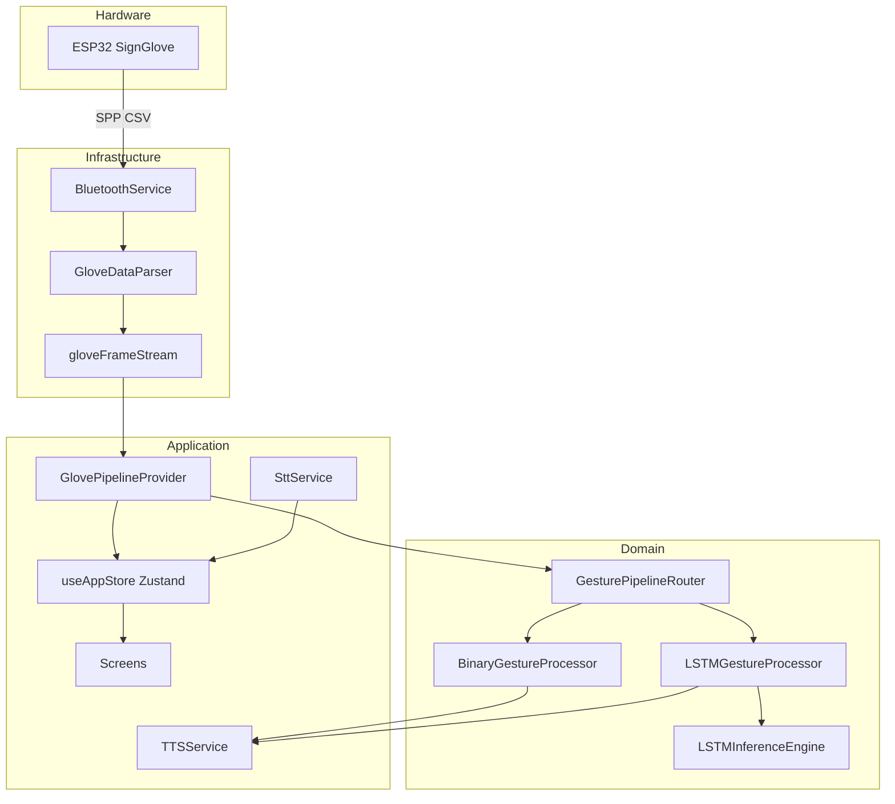

# البنية المعمارية

## نظرة عليا



---

## طبقات التطبيق

| الطبقة | المسؤولية | أمثلة |
|--------|-----------|--------|
| **Presentation** | UI | `src/screens/*`, `src/components/*` |
| **Application** | ربط UI بالمنطق | `src/hooks/*`, `useAppStore` |
| **Domain** | معالجة الإيماءات | `binary/`, `ml/`, `pipeline/` |
| **Infrastructure** | BT، ONNX، TTS، STT | `bluetooth/`, `parser/`, `tts/`, `stt/` |

---

## تدفق البيانات (القفاز)

```text
1. BluetoothService.connect(deviceId, { delimiter: '\r' })
2. onDataReceived(chunk) → GloveDataParser.pushChunk(chunk)
3. لكل GloveFrame صالح → gloveFrameStream.emit(frame)
4. GlovePipelineProvider يحدّث latestFrame في الـ store
5. إذا inputSource === 'glove':
     gesturePipeline.processFrame(frame)
6. النتيجة المستقرة → setGestureResult + TTS + History
```

---

## GesturePipelineRouter

ملف: `src/features/pipeline/GesturePipelineRouter.ts`

| الوضع النشط | المعالج | سلوك onFrame |
|-------------|---------|--------------|
| `binary` | `BinaryGestureProcessor` | تحويل فوري + debounce |
| `sensor` | `LSTMGestureProcessor` | يجمع فقط أثناء `collecting` |

تبديل الوضع عبر `useActiveMode('binary' | 'sensor')` عند دخول الشاشة.

---

## GlovePipelineProvider

ملف: `src/providers/GlovePipelineProvider.tsx`

يُحمَّل مرة واحدة في `app/_layout.tsx` ويقوم بـ:

1. تحميل ONNX عند الإقلاع
2. الاشتراك في اتصال Bluetooth
3. توجيه الإطارات للـ pipeline
4. تشغيل TTS عند نتيجة مستقرة
5. إضافة History (AI / Binary)

---

## الحالة المركزية (Zustand)

ملف: `src/store/useAppStore.ts`

| الحقل | الاستخدام |
|-------|-----------|
| `connectionState` | disconnected / connected / … |
| `latestFrame` | آخر إطار من القفاز |
| `gestureResult` | نتيجة Binary أو AI |
| `inputSource` | `glove` \| `manual` |
| `activeMode` | `binary` \| `sensor` |
| `modelStatus` | idle / loading / ready / error |
| `aiCollectionState` | idle / collecting / predicting |
| `history` | قائمة محفوظة AsyncStorage |

---

## GloveFrame

تعريف: `src/features/parser/types.ts`

```typescript
{
  timestamp: number;
  flex: { thumb, index, middle, ring, pinky };
  imu: { ax, ay, az, gx, gy, gz };
  orientation: { pitch, roll };
}
```

---

## Expo Router

| الملف | الشاشة |
|-------|--------|
| `app/index.tsx` | Splash |
| `app/home.tsx` | Home |
| `app/choose-mode.tsx` | اختيار الوضع |
| `app/binary-mode.tsx` | Binary |
| `app/ai-mode.tsx` | AI |
| `app/history.tsx` | History |

---

## Plugins مخصصة

| Plugin | السبب |
|--------|--------|
| `withOnnxRuntimePackage.js` | ONNX مستثنى من autolinking Expo |
| `withSttPackInstaller.js` | تحميل حزمة STT العربية |

---

## اعتماديات native حرجة

| الحزمة | الاستخدام |
|--------|-----------|
| `react-native-bluetooth-classic` | Bluetooth Classic SPP |
| `onnxruntime-react-native` | استدلال LSTM |
| `expo-speech-recognition` | STT |
| `expo-speech` | TTS |

**لا تعمل في Expo Go** — يتطلب dev build أو APK.

---

## قرارات تصميم

| القرار | السبب |
|--------|--------|
| Classic BT وليس BLE | توافق مع firmware الحالي |
| تسجيل يدوي في AI | دقة أعلى من كشف الحركة التلقائي |
| delimiter `\r` | سلوك ESP32 BluetoothSerial |
| Zustand | حالة بسيطة بدون boilerplate |
| Provider واحد للـ pipeline | تجنب تكرار الاشتراكات في كل شاشة |

---

## الخطوة التالية

- [استكشاف الأخطاء](./08-troubleshooting.md)
