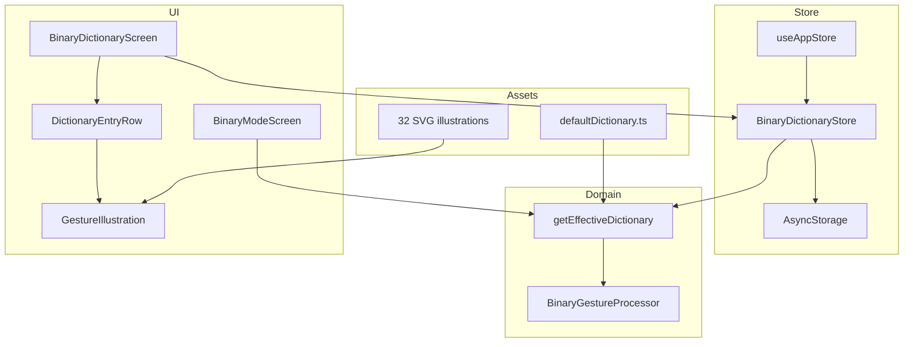

# Binary Dictionary Customization — خطة التنفيذ الكاملة

> **Phase 1.5** — تخصيص قاموس Binary Mode مع 32 illustration لكل إشارة  
> **الحالة:** منفّذ — Store + UI + illustrations  
> **آخر تحديث:** يوليو 2026

---

## 1. الهدف

تمكين كل مستخدم من:

1. **تعديل معنى** أي من الـ 32 pattern حسب احتياجه اليومي
2. ربط pattern بـ **كلمة أو جملة كاملة** (TTS + عرض)
3. **رؤية illustration** توضّح شكل الإشارة (أي أصابع مثنية/مفرودة) — مش بس `01011`
4. **حفظ التخصيص** محلياً على الجهاز (AsyncStorage)
5. **الرجوع للافتراضي** entry واحد أو القاموس كله

---

## 2. لماذا الميزة مهمة؟

| بدون تخصيص | مع تخصيص |
|------------|----------|
| 32 كلمة ثابتة للجميع | 32 slot شخصية |
| المستخدم يحفظ binary codes | المستخدم يحفظ **شكل اليد** من الصورة |
| demo تقني | أداة تواصل يومية (AAC-style) |
| «نعم / لا / مساعدة» فقط | «محاضرة انتهت»، «عايز أنزل هنا»، «محتاج ممرض» |

**Positioning للعرض:**

> Binary Mode offers 32 customizable gesture slots. Each slot shows a hand illustration and can speak a personal word or full sentence.

---

## 3. ما تم إنجازه (Assets)

### 3.1 Illustrations — 32 SVG

| المسار | الوصف |
|--------|--------|
| `assets/binary-gestures/*.svg` | 32 illustration (00000 … 11111) |
| `scripts/generate_binary_gesture_illustrations.py` | سكربت إعادة التوليد |
| `src/features/binary/gestureIllustrations.ts` | Map: pattern → asset |

**تصميم الـ illustration:**

- خلفية داكنة (`#0B1020`) متوافقة مع theme التطبيق
- **إصبع مفرود (0):** رمادي فاتح — vertical
- **إصبع مثني (1):** بنفسجي (`#A855F7`) — folded
- Badge أعلى اليسار: pattern (`01011`)
- Labels أسفل: `T:0  I:1  M:0  R:1  P:1`

**إعادة التوليد:**

```bash
python scripts/generate_binary_gesture_illustrations.py
```

### 3.2 جدول الـ 32 pattern (افتراضي)

| Pattern | العربية | Pattern | العربية |
|---------|---------|---------|---------|
| 00000 | جاهز | 10000 | ماء |
| 00001 | مرحبا | 10001 | طعام |
| 00010 | شكرا | 10010 | تعبان |
| 00011 | نعم | 10011 | بخير |
| 00100 | لا | 10100 | سعيد |
| 00101 | مساعدة | 10101 | حزين |
| 00110 | من فضلك | 10110 | طوارئ |
| 00111 | آسف | 10111 | أين |
| 01000 | صباح الخير | 11000 | متى |
| 01001 | مساء الخير | 11001 | كيف |
| 01010 | مع السلامة | 11010 | لماذا |
| 01011 | تباعد | 11011 | من |
| 01100 | أحبك | 11100 | ماذا |
| 01101 | أفهم | 11101 | أريد |
| 01110 | لا أفهم | 11110 | انتظر |
| 01111 | كيف حالك | 11111 | توقف |

كل pattern له ملف: `assets/binary-gestures/{pattern}.svg`

---

## 4. البنية المعمارية



### 4.1 دمج القاموس

```text
effectiveEntry(bits) = userOverride[bits] ?? defaultEntry(bits)

defaultEntry  = { phrase, english } from defaultDictionary.ts
userOverride  = { phrase, english?, customImageUri? } from AsyncStorage
```

**ملاحظة:** الـ `bits` ثابتة (32 slot) — المستخدم **لا يضيف** patterns جديدة، فقط يعدّل المحتوى.

---

## 5. نموذج البيانات

```typescript
// src/features/binary/types.ts (جديد)

export interface DictionaryEntry {
  bits: string;           // "01011" — immutable key
  phrase: string;         // يُعرض + يُنطق (كلمة أو جملة)
  english?: string;       // optional — للنسخ/العرض
  customImageUri?: string; // optional — صورة شخصية (Phase 1.5b)
  isCustomized?: boolean; // true if phrase differs from default
}

export interface DictionaryOverrides {
  version: 1;
  entries: Record<string, Omit<DictionaryEntry, 'bits'>>;
}
```

**AsyncStorage key:** `@signtalker/binary-dictionary`

**مثال JSON محفوظ:**

```json
{
  "version": 1,
  "entries": {
    "01011": {
      "phrase": "محتاج دورة مياه",
      "english": "I need the restroom",
      "isCustomized": true
    },
    "10110": {
      "phrase": "طوارئ — محتاج ممرض فوراً",
      "english": "Emergency — need a nurse now",
      "isCustomized": true
    }
  }
}
```

---

## 6. الملفات — ما يُنشأ وما يُعدَّل

### 6.1 ملفات جديدة

| الملف | المسؤولية |
|-------|-----------|
| `src/features/binary/types.ts` | DictionaryEntry, overrides types |
| `src/features/binary/BinaryDictionaryStore.ts` | load / save / merge / reset |
| `src/features/binary/gestureIllustrations.ts` | ✅ map pattern → SVG asset |
| `src/components/GestureIllustration.tsx` | عرض illustration (SVG/PNG) |
| `src/components/DictionaryEntryRow.tsx` | صف في القائمة: صورة + pattern + phrase |
| `src/components/DictionaryEditModal.tsx` | modal تعديل phrase + test TTS |
| `src/screens/BinaryDictionaryScreen.tsx` | شاشة القاموس الكاملة |
| `app/binary-dictionary.tsx` | Expo Router route |
| `assets/binary-gestures/*.svg` | ✅ 32 illustration |
| `scripts/generate_binary_gesture_illustrations.py` | ✅ generator |

### 6.2 ملفات تُعدَّل

| الملف | التعديل |
|-------|---------|
| `src/features/binary/BinaryGestureProcessor.ts` | lookup من effective dictionary |
| `src/features/binary/defaultDictionary.ts` | export `getDefaultEntry(bits)` |
| `src/store/useAppStore.ts` | binaryDictionary state + actions |
| `src/providers/GlovePipelineProvider.tsx` | load dictionary on boot |
| `src/screens/BinaryModeScreen.tsx` | زر "Customize" + effective dict |
| `src/hooks/useGlovePipeline.ts` | تمرير dictionary للـ display |
| `docs/04-binary-mode.md` | قسم customization |
| `docs/README.md` | رابط لهذه الخطة |
| `README.md` | Phase 1.5 status |
| `package.json` | `react-native-svg` (لعرض SVG) |

---

## 7. BinaryDictionaryStore — API

```typescript
// src/features/binary/BinaryDictionaryStore.ts

const STORAGE_KEY = '@signtalker/binary-dictionary';

export class BinaryDictionaryStore {
  /** Load overrides from AsyncStorage */
  static async load(): Promise<DictionaryOverrides | null>;

  /** Merge defaults + overrides → 32 entries */
  static getEffectiveDictionary(
    overrides: DictionaryOverrides | null,
  ): Record<string, DictionaryEntry>;

  /** Save one entry override */
  static async saveEntry(
    bits: string,
    phrase: string,
    english?: string,
  ): Promise<DictionaryOverrides>;

  /** Remove override → revert to default */
  static async resetEntry(bits: string): Promise<DictionaryOverrides>;

  /** Clear all overrides */
  static async resetAll(): Promise<null>;

  /** Optional: export/import JSON profile */
  static exportProfile(overrides: DictionaryOverrides): string;
  static importProfile(json: string): DictionaryOverrides;
}
```

---

## 8. BinaryGestureProcessor — التعديل

**قبل:**

```typescript
const label = lookupWord(pattern);
const phrase = label;
```

**بعد:**

```typescript
const entry = effectiveDictionary[pattern];
const phrase = entry?.phrase ?? lookupWord(pattern);
const label = phrase; // or short label derived from phrase
```

**Manual bits + live glove** — نفس المصدر `effectiveDictionary`.

---

## 9. عرض SVG في React Native

Expo لا يدعم `require('*.svg')` مباشرة بدون transformer.

### Option A (Recommended): `react-native-svg` + transformer

```bash
npx expo install react-native-svg
npm install --save-dev react-native-svg-transformer
```

`metro.config.js`:

```javascript
const { getDefaultConfig } = require('expo/metro-config');

module.exports = (() => {
  const config = getDefaultConfig(__dirname);
  config.transformer.babelTransformerPath = require.resolve('react-native-svg-transformer');
  config.resolver.assetExts = config.resolver.assetExts.filter((ext) => ext !== 'svg');
  config.resolver.sourceExts = [...config.resolver.sourceExts, 'svg'];
  return config;
})();
```

`GestureIllustration.tsx`:

```tsx
import { Image } from 'expo-image';
import { getGestureIllustration } from '@/src/features/binary/gestureIllustrations';

export function GestureIllustration({ bits, size = 80 }: { bits: string; size?: number }) {
  const source = getGestureIllustration(bits);
  if (!source) return null;
  return <Image source={source} style={{ width: size, height: size }} contentFit="contain" />;
}
```

> **بديل:** تحويل SVG → PNG بنفس السكربت واستخدام `expo-image` بدون transformer.

### Option B: PNG fallback

توسيع السكربت لتوليد PNG (يتطلب `cairosvg` أو `pillow`) — أنسب لو فريق Mobile يرفض svg transformer.

---

## 10. UI — شاشة تعديل القاموس

### 10.1 Navigation

```text
Home / Binary Mode
    └── "Customize Dictionary" → BinaryDictionaryScreen
```

Route: `/binary-dictionary`

### 10.2 Layout — قائمة

```text
┌─────────────────────────────────────────────┐
│ ← Back          Customize Dictionary        │
├─────────────────────────────────────────────┤
│  [Search: filter by phrase or pattern...]   │
├─────────────────────────────────────────────┤
│ ┌──────┐  01011                             │
│ │ 🖐️  │  تباعد                    [Edit]  │
│ │ SVG  │  Keep distance                     │
│ └──────┘                                    │
│ ┌──────┐  00011                             │
│ │ 🖐️  │  نعم                       [Edit]  │
│ └──────┘                                    │
│ ... (32 rows, FlatList)                     │
├─────────────────────────────────────────────┤
│  [Reset All to Defaults]                    │
└─────────────────────────────────────────────┘
```

### 10.3 Layout — Edit Modal

```text
┌─────────────────────────────────────────────┐
│           Edit Gesture  01011               │
│  ┌─────────────────┐                        │
│  │   illustration  │   T:0 I:1 M:0 R:1 P:1 │
│  │     (240px)     │                        │
│  └─────────────────┘                        │
│                                             │
│  Arabic phrase *                            │
│  ┌─────────────────────────────────────┐    │
│  │ محتاج دورة مياه                     │    │
│  └─────────────────────────────────────┘    │
│  English (optional)                         │
│  ┌─────────────────────────────────────┐    │
│  │ I need the restroom                 │    │
│  └─────────────────────────────────────┘    │
│                                             │
│  [▶ Test Speech]  [Reset Entry]  [Save]     │
└─────────────────────────────────────────────┘
```

### 10.4 Validation

| Rule | Detail |
|------|--------|
| `phrase` | required, 1–120 chars |
| `english` | optional, max 120 chars |
| `bits` | read-only, must be valid 5-bit key |
| empty phrase | block save |

### 10.5 Binary Mode — integration

- زر **"Customize Dictionary"** تحت Bit Matrix
- عند detection: عرض phrase من effective dict
- `DetectionCard`: illustration صغيرة (optional) بجانب الكلمة

---

## 11. TTS للجمل الطويلة

`TTSService` يقبل أي string — لا تعديل إلزامي.

**تحسين اختياري:**

```typescript
Speech.speak(trimmed, {
  language: 'ar',
  rate: trimmed.length > 40 ? 0.85 : 0.95,
});
```

---

## 12. History + English translation

| Case | English shown |
|------|---------------|
| Default entry | من `EN_DICTIONARY` |
| Custom + english filled | user english |
| Custom + no english | `"Custom phrase"` أو إخفاء EN |

`GlovePipelineProvider` — عند addHistory:

```typescript
const english = entry.english ?? translateArabic(result.label) ?? 'Custom phrase';
```

---

## 13. مراحل التنفيذ

### Phase 1.5a — Core (1–2 يوم)

- [ ] `BinaryDictionaryStore` + types
- [ ] `useAppStore` actions + load on boot
- [ ] `BinaryGestureProcessor` → effective dictionary
- [ ] `GestureIllustration` component
- [ ] `BinaryDictionaryScreen` + route
- [ ] `DictionaryEntryRow` + `DictionaryEditModal`
- [ ] زر من `BinaryModeScreen`
- [ ] `react-native-svg` setup
- [ ] تحديث `docs/04-binary-mode.md`

### Phase 1.5b — Polish (نصف يوم)

- [ ] Search/filter في قائمة القاموس
- [ ] Badge "Custom" على entries معدّلة
- [ ] Reset entry / reset all
- [ ] Test TTS من modal
- [ ] Haptic feedback on save

### Phase 1.5c — Bonus (اختياري)

- [ ] Export/Import JSON profile
- [ ] `customImageUri` — صورة شخصية per entry (`expo-image-picker`)
- [ ] illustration preview في Binary Mode detection card
- [ ] PNG export من generator script

---

## 14. Test Plan

```text
□ Load app → dictionary defaults unchanged
□ Edit 01011 → "محتاج دورة مياه" → save → persists after restart
□ Binary Mode glove/manual → new phrase detected + TTS
□ Reset entry → reverts to "تباعد"
□ Reset all → 32 defaults restored
□ All 32 illustrations render in list
□ Edit modal shows correct illustration for pattern
□ Long phrase (80 chars) → TTS speaks without crash
□ Invalid/empty phrase → save blocked
□ History records custom phrase + english
□ AI Mode unaffected by dictionary changes
```

---

## 15. تقسيم الفريق (مرجع)

| العضو | الملفات |
|-------|---------|
| **03 — Binary/TTS** | Store, Processor, Dictionary screen, TTS tuning |
| **01 — Integration** | useAppStore, Provider, routing |
| **04 — UI polish** | Components, theme, modal UX |
| **Designer (optional)** | تحسين illustrations يدوياً بدل generated |

---

## 16. مخاطر وحلول

| Risk | Mitigation |
|------|------------|
| SVG لا يعمل على Android | svg transformer أو PNG fallback |
| جملة طويلة في UI | multiline Text, scroll in modal |
| المستخدم ينسى patterns | illustration + labels T/I/M/R/P |
| AsyncStorage corrupt | try/catch + fallback to defaults |
| تخصيص يتعارض مع demo | "Reset All" + export profile |

---

## 17. Story للعرض (30 ثانية)

> «Binary Mode في SignTalker مش مجرد 32 كلمة ثابتة. كل مستخدم يقدر يفتح Customize Dictionary، يشوف illustration لشكل كل إشارة، ويغيّر المعنى لكلمة أو جملة تناسب حياته اليومية. التخصيص بيتحفظ على الجهاز، والنظام ينطق العبارة الجديدة فوراً.»

---

## 18. روابط

- [Binary Mode](./04-binary-mode.md)
- [Architecture](./07-architecture.md)
- [Team: Member 03](./team/03-mobile-binary-tts.md)
- Assets: `assets/binary-gestures/`
- Generator: `scripts/generate_binary_gesture_illustrations.py`
