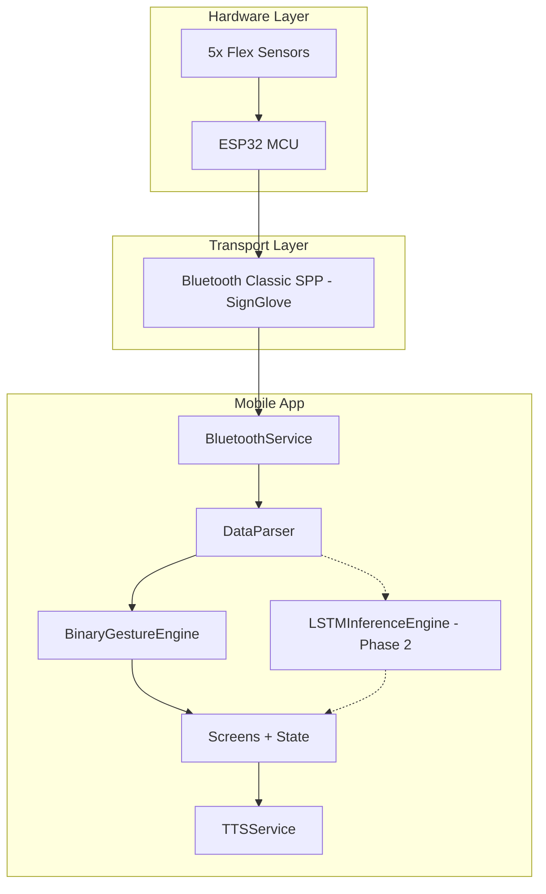

# SignBridge — Architecture Reference (Full System)

> **Status:** Reference document — do not edit for day-to-day Phase 1 work.  
> **Active plan:** [phase1_binary_mode.plan.md](../.cursor/plans/phase1_binary_mode.plan.md)  
> **Last updated:** 2026-05-31

---

## Executive Summary

Closed-loop assistive system: ESP32 glove → wireless stream → React Native app → gesture interpretation → UI + speech.

| Track | Location | Status |
|-------|----------|--------|
| Mobile UI prototype | `smart-glove-app/` | UI only, no hardware/ML/TTS |
| ESP32 firmware | `hardware/test1/test1.ino` | Working at 20 Hz, Bluetooth Classic |
| LSTM training | `en-sign-language/` | `.h5` + `.joblib`, not mobile-ready |
| TTS reference | `Smart_Gloves/mobile_app/` | Flask API pattern (optional fallback) |

**Direction:** Phase 1 = Binary Mode + Bluetooth Classic + on-device TTS. Phase 2 = LSTM on-device.

---

## System Architecture



---

## Firmware Data Format

### Canonical live stream (ESP32 → App)

One CSV line per frame, no header, no `DATA` prefix:

```
<timestamp>,flex_thumb,flex_index,flex_middle,flex_ring,flex_pinky,ax,ay,az,gx,gy,gz,pitch,roll
```

> Dataset CSV files with header rows are used for **ML training offline only** — not loaded by the mobile app.

### Legacy format (current test1.ino — to be migrated)

```
DATA,<timestamp_ms>,<f1..f5>,<ax>..<roll>
```

Parser accepts **both** during firmware migration.

- Device name: `SignGlove`
- Sample rate: 20 Hz (50 ms interval)
- Flex pins: 35, 32, 33, 25, 26 (Thumb → Pinky)

### Binarization (Binary mode)

| Condition | Bit | Arabic |
|-----------|-----|--------|
| `flex >= 2000` | 1 | مثني |
| `flex < 2000` | 0 | مفرود |

### Mode-specific translation (live stream only)

| Mode | Mechanism | Not used |
|------|-----------|----------|
| Binary | 32-word dictionary lookup | No dataset, no ML |
| Sensor/AI | LSTM model live inference (Phase 2) | No dictionary |

---

## Mobile App Layers

```
Presentation (Screens/Components)
        ↓
Application (Hooks + Stores)
        ↓
Domain (Engines: Binary, LSTM, Dictionary)
        ↓
Infrastructure (Bluetooth, TTS, Storage, ML Runtime)
```

---

## Target Folder Structure

```
smart-glove-app/
├── app/                    # Expo Router routes only
├── src/
│   ├── components/
│   ├── features/
│   │   ├── bluetooth/
│   │   ├── parser/
│   │   ├── binary/
│   │   ├── ml/             # Phase 2
│   │   └── tts/
│   ├── store/
│   ├── hooks/
│   └── theme/
├── assets/
└── docs/
```

---

## Bluetooth

### Phase 1: Classic (current firmware)
- Library: `react-native-bluetooth-classic`
- Requires Expo Development Build (not Expo Go)

### Future: BLE GATT
- Library: `react-native-ble-plx`
- Abstract via `IBluetoothService` interface

---

## ML Pipeline (Phase 2)

| Aspect | Current Python model | Target mobile |
|--------|---------------------|---------------|
| Input | `(1, 1, ~440)` flat features | `(1, 20, 5)` flex sequence |
| Export | `.h5` + `.joblib` | `.tflite` + JSON preprocessors |
| Runtime | Desktop Python | `react-native-fast-tflite` |

Labels today: PAUSE, PROUD, STUDENT, THANK YOU, THIS, WE, WORK

---

## Recommended Libraries

| Purpose | Library |
|---------|---------|
| BT Classic (Phase 1) | `react-native-bluetooth-classic` |
| BLE (future) | `react-native-ble-plx` |
| On-device ML (Phase 2) | `react-native-fast-tflite` |
| TTS (Phase 1) | `expo-speech` |
| State | `zustand` |
| Storage | `@react-native-async-storage/async-storage` |

---

## Implementation Phases

### Phase 1 — Binary Mode MVP
Binary gesture detection + BT Classic + TTS + live UI

### Phase 1.5 — Polish
Device picker, calibration UI, flex charts, dictionary editor

### Phase 2 — AI Sensor Mode
Retrain LSTM, export TFLite, wire Sensor Mode

### Phase 3 — Optional
BLE firmware migration, expanded vocabulary, Arabic TTS

---

## Key Risks

| Risk | Mitigation |
|------|------------|
| iOS Classic BT limited | Demo on Android |
| Expo Go can't run BT | Development Build |
| ML model mismatch | Retrain in Phase 2; Binary Mode independent |
| Flex sensor drift | Per-finger calibration |
| TTS spam | 2s cooldown on new word |

---

## Full Architecture Diagram

```
╔══════════════════════════════════════════════════════════════════════════════╗
║                    SIGNBRIDGE — SYSTEM ARCHITECTURE v1.0                     ║
╠══════════════════════════════════════════════════════════════════════════════╣
║  PHYSICAL: 5× Flex + MPU6050 + OLED                                          ║
║  EMBEDDED: ESP32 → Calibrate → Filter → CSV → BluetoothSerial (SignGlove)    ║
║  MOBILE:   BluetoothService → Parser → BinaryEngine/LSTM → TTS → UI         ║
║  OFFLINE:  Python train → export .tflite (Phase 2)                           ║
╚══════════════════════════════════════════════════════════════════════════════╝
```

See original full plan at `.cursor/plans/signbridge_architecture_plan_b5d6d999.plan.md` for complete detail.
